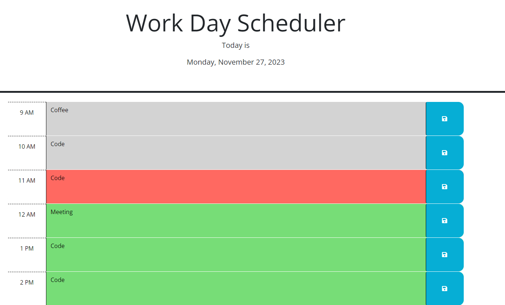

# Work Day Scheduler | Module 5 Challenge

## Challenge Overview

### Challenge Criteria
This challenge is apart of the coding bootcamp. Its purpose is to utilize third party API's to manipulate the DOM and display information to the user. To complete this challenge I used dayjs to work with dates and JQuery for changing the DOM. The acceptance criteria is the following:

    -GIVEN I am using a daily planner to create a schedule
    -WHEN I open the planner
    -THEN the current day is displayed at the top of the calendar
    -WHEN I scroll down
    -THEN I am presented with timeblocks for standard business hours of 9am&ndash;5pm
    -WHEN I view the timeblocks for that day
    -THEN each timeblock is color coded to indicate whether it is in the past, present, or future
    -WHEN I click into a timeblock
    -THEN I can enter an event
    -WHEN I click the save button for that timeblock
    -THEN the text for that event is saved in local storage
    -WHEN I refresh the page
    -THEN the saved events persist

## Installation
No installation required 

## Usage
To view the project just use the link below to see the page on github pages!

    - https://chaselee21.github.io/work-week-planner/

## Contributing
For this project I was given an index file and css sheet as a starting point. The script and changes to the index file were done by myself. I did reference the dayjs documentation found here:

    - https://day.js.org/docs/en/display/format

## License

Please refer to the license in the repo
